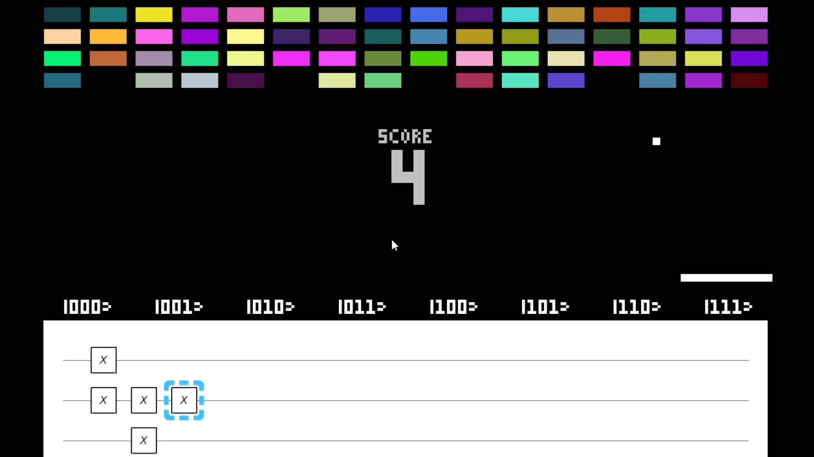

<!-- Replace with a hero screenshot/GIF of the game (e.g. a level concept board + circuit). -->


[](https://ashmitjsg.itch.io/quantum-breakout)
&nbsp;[](https://youtu.be/jnlsQTBWw98)
&nbsp;[](https://github.com/ashmitjsg/Quantum-Breakout)
&nbsp;[](https://pypi.org/project/qcge/)

# Quantum Breakout
*Break bricks by programming a quantum circuit - your paddle is a qubit register, and you steer it with quantum gates.*

# Author
Ashmit JaiSarita Gupta

- **▶ Play in your browser:** https://ashmitjsg.itch.io/quantum-breakout
- **Game repo:** https://github.com/ashmitjsg/Quantum-Breakout
- **Engine (qcge):** https://github.com/ashmitjsg/Quantum-Circuit-Game-Engine · [`pip install qcge`](https://pypi.org/project/qcge/)
- **Video demo:** https://youtu.be/jnlsQTBWw98

## ▶ Watch the demo

[](https://youtu.be/jnlsQTBWw98)

*A 5-level playthrough showing each quantum concept in action (click to watch on YouTube).*

---

## What you'll learn

Quantum Breakout teaches the foundational ideas of quantum computing by making you *use*
them to win:

1. **Qubits and basis states** - a register of `n` qubits has `2ⁿ` configurations.
2. **The X gate (bit flip)** - deterministic control of which configuration you're in.
3. **Superposition (Hadamard)** - being in several configurations at once, with probabilities.
4. **Measurement and collapse** - looking forces a single random outcome.
5. **Phase and interference (Z, S, T)** - hidden structure that steers amplitudes.
6. **Entanglement (controlled-X)** - linking qubits so one decides the other.

There is **no separate notebook to read** - every concept is taught *inside the game*, on a
short board before each level, and then practised by playing that level.

## How to play (30 seconds)

Your **paddle is a 3-qubit quantum state**, so it can be over **8 positions** (`000`..`111`)
at once. The brightness of the paddle at each position is the **probability** of finding it
there. When the ball comes close, the state is **measured** and the paddle **collapses** to
one position - if that's where the ball is, you bounce it and break a brick.

You control the paddle by **building a quantum circuit** on the grid:

| Keys | Action |
|------|--------|
| **Arrow keys** | move the circuit cursor |
| **X / Y / Z / H** | place an X, Y, Z, or Hadamard gate |
| **S / T** | place an S or T phase gate |
| **C**, then **R / F** | make a gate *controlled* (e.g. CX), control on the wire above/below |
| **Q / E** | turn X/Y/Z into a rotation, −/+ π⁄8 |
| **Backspace / Delete** | remove a gate / clear the circuit |
| **Space** | advance the concept board / start a level |

(The cursor uses the **arrow keys** on purpose, so the **S** and **T** keys are free for the
S and T gates.)

---

## The quantum tutorial, level by level

The paddle's 8 positions are the 8 computational basis states of 3 qubits. We use the same
ordering as Qiskit (little-endian: qubit 0 is the least-significant bit), so what you learn
here transfers directly to real quantum code.

### Level 1 - Qubits & the X gate

A single qubit has two basis states, written `|0⟩` and `|1⟩`. Three qubits give
`2³ = 8` basis states, `|000⟩` through `|111⟩` - the 8 paddle positions.

The **X gate** is the quantum NOT: it flips one qubit, `|0⟩ ↔ |1⟩`. Place X gates and the
paddle moves to a single, definite position. No randomness yet - this is your "manual
steering", and it's how you reliably catch the ball early on.

> **Try it:** put the paddle exactly under the ball using X gates, and break 5 bricks.

### Level 2 - Superposition (Hadamard)

The **H (Hadamard) gate** puts a qubit into an equal **superposition** of 0 and 1:

```
H|0⟩ = (|0⟩ + |1⟩) / √2
```

Now the qubit is *both* values at once. With one H, your paddle covers **two** positions,
each with **50%** probability - shown as half-brightness paddles. Superposition doubles your
coverage but halves the certainty at each spot.

### Level 3 - Measurement & Collapse

You never observe a superposition directly. **Measuring** it - which is exactly what happens
when the ball arrives - forces the state to **collapse** to a single basis state, chosen at
random, weighted by the probabilities you built. Build `H` on one wire and you have a 50/50
gamble; the more you spread the state, the lower your odds at any one position. The skill is
to keep probability concentrated where the ball will be.

### Level 4 - Phase & interference (Z, S, T)

Beyond 0 and 1, an amplitude carries a **phase** (a complex sign). The **Z, S, T** gates
rotate this phase (by π, π⁄2, π⁄4). Phase is **invisible to a single measurement** - but it
changes how amplitudes **interfere** when you apply more gates. The classic example:

```
H · Z · H  =  X      (a phase flip between two Hadamards becomes a bit flip)
```

So you can steer the paddle *through interference* - place a phase gate between two H gates
and watch the destination change.

### Level 5 - Entanglement (controlled-X)

A **controlled-X (CX / CNOT)** links two qubits: it flips the *target* qubit **only when the
control qubit is 1**. Apply it after a Hadamard and you build a **Bell state**:

```
CX · (H ⊗ I) |00⟩ = (|00⟩ + |11⟩) / √2
```

The two qubits are now **entangled**: the paddle covers two *correlated* positions, and
measuring one qubit instantly determines the other. In-game: press **H** on the control wire,
**X** on the target wire, then **C** and **R/F** to attach the control.

---

## Under the hood - how the game is built

The quantum logic lives in a small, reusable engine, **[qcge](https://pypi.org/project/qcge/)**
(Quantum Circuit Game Engine), which I extracted so any pygame game can embed a quantum
circuit. The game itself is `pip install qcge` away.

**The loop is simple and faithful to the physics:**

1. You edit a circuit on the grid. The grid emits a backend-agnostic intermediate
   representation (a list of gates).
2. Each frame, the circuit is simulated to a **statevector** of 8 complex amplitudes.
3. Each paddle's opacity is set to `|amplitudeᵢ|²` - the **probability** of position `i`.
4. When the ball nears, one **measurement shot** samples a single position from those
   probabilities; the paddle collapses there and the collision is checked.

```python
from qcge import QuantumCircuitGrid

grid = QuantumCircuitGrid(position=(0, 0), num_qubits=3, num_columns=16)
# ... the player builds a circuit on the grid ...

statevector = grid.get_statevector()      # 8 complex amplitudes (little-endian, Qiskit order)
probs       = [abs(a)**2 for a in statevector]   # paddle opacities
collapsed   = grid.get_counts(shots=1)    # one measurement -> the paddle's position
```

**One game, two quantum backends.** `qcge` picks the backend automatically:

- **On the desktop** it uses **real Qiskit** (`qiskit.quantum_info.Statevector`, Qiskit ≥ 2.0).
- **In the browser** Qiskit can't run (its compiled extensions aren't available under
  Pyodide/WebAssembly), so `qcge` falls back to a **dependency-free pure-Python statevector
  simulator** - verified to match Qiskit and numpy *exactly*. This is what makes the game
  playable on itch.io with no install.

A subtle but important detail for browser games: **importing numpy inside a pygbag build
breaks the SDL display**, so the whole browser path is kept numpy-free - the pure-Python
backend uses only the standard library.

## Run it yourself

**Play instantly (no install):** https://ashmitjsg.itch.io/quantum-breakout

**Desktop (Python):**

```bash
git clone https://github.com/ashmitjsg/Quantum-Breakout
cd Quantum-Breakout
python -m venv venv && source venv/bin/activate   # Windows: venv\Scripts\activate
pip install -r requirements-dev.txt               # installs qcge[qiskit] + pygame
python main.py
```

## Dependencies explained

| Package | Why |
|---------|-----|
| **[qcge](https://pypi.org/project/qcge/)** `>=2.0` | the quantum-circuit grid + simulation engine (this game's quantum core) |
| **qiskit** `>=2.0` (via `qcge[qiskit]`) | the real quantum simulator used on the desktop; 1.x is end-of-life |
| **pygame** `>=2.1` | rendering, input, and the game loop |
| **numpy** | pulled in by qcge/qiskit on the desktop; **not used in the browser** (see above) |
| **pygbag** (build-time only) | compiles the pygame game to WebAssembly for the itch.io build |

The browser build bundles `qcge`'s pure-Python backend only, so it needs **neither Qiskit nor
numpy** at runtime.

## How I got started in quantum

<!-- Personalise this (the bounty asks for it). A short, honest paragraph, e.g.: -->
I got into quantum computing through Qiskit's *12 Days of Qiskit* series and the QPong game
by Junye Huang - seeing a quantum concept turned into something you could *play* made
superposition and measurement click for me far faster than equations did. I've been building
small quantum games since, and Quantum Breakout (and the qcge engine behind it) is my attempt
to pass that "learn by playing" feeling on to the next person.

## AI-usage disclosure

**The original work was written without any AI.** The first Quantum Breakout and the first
version of the qcge engine were built by me by hand in **2023** (for a college tech fest),
before LLM coding assistants were part of my workflow.

This **2026 v2** builds on that earlier, human-written foundation, and here I used **AI as a
collaborative tool** (an LLM coding assistant), not as an autonomous author. I directed the
design and all the quantum/game decisions, reviewed and tested every change, and ran each one
on both the desktop and browser builds. The AI helped with the 2026 work specifically:
refactoring the engine into the pluggable-backend architecture, porting the simulator to a
numpy-free pure-Python implementation for the browser, debugging the pygbag/WebAssembly build,
writing tests, and drafting documentation (including this tutorial, which I edited). All quantum
behaviour is verified against Qiskit.

## Credits & references

- Inspired by **QPong** (Junye Huang, Unitary Fund / Qiskit *12 Days of Qiskit*):
  https://kirais.itch.io/qpong and the QPong project.
- A quantum re-imagining of Atari's *Breakout*.
- Engine: **qcge** - https://pypi.org/project/qcge/
- Qiskit textbook (superposition, measurement, entanglement): https://qiskit.org/
