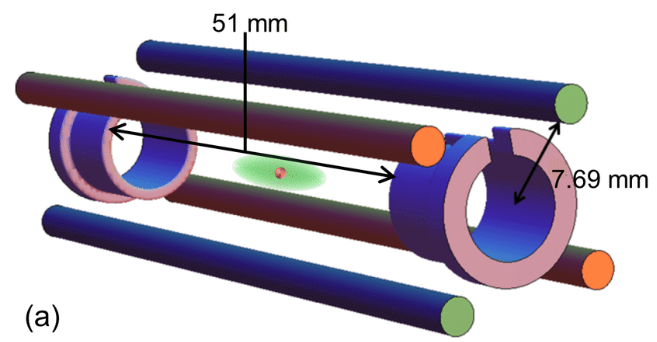
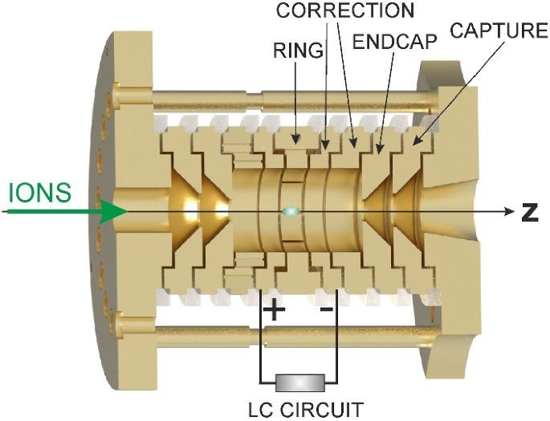
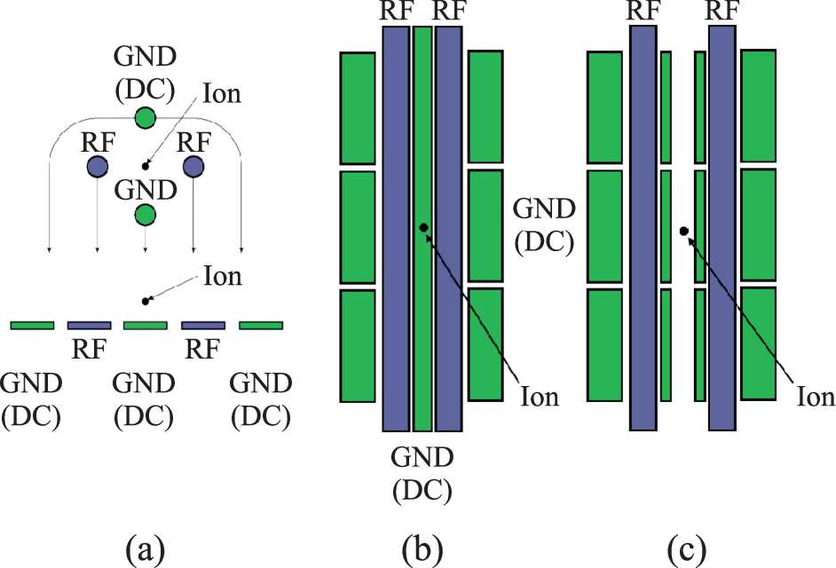

Trapped ion quantum computers store information in charged atomic ions, held in place by electromagnetic fields and manipulated with lasers or microwaves. These systems are renowned for their long coherence times and high-fidelity operations, making them one of the most mature quantum computing platforms.

Ion-based qubits are manipulated using precise laser or microwave pulses, while entangling operations rely on shared vibrational modes (phonons) of the ions within a trap.

---

## Ion Trap Technologies

### 1. Linear Paul Traps

Linear Paul traps confine ions using a combination of static (DC) and rapidly oscillating (RF) electric fields. The ions align into a one-dimensional chain due to mutual repulsion, and high-precision control is achieved using laser beams.

- **Typical ions**: Yb⁺, Ca⁺, Ba⁺
- **Entangling gates**: Mølmer–Sørensen, Cirac–Zoller
- **Laser configuration**: Raman beams or direct single-frequency lasers
- **Used by**: IonQ, NIST, University of Innsbruck

  
*Schematic of a linear Paul trap showing the central ion-trapping region between RF and DC electrodes. This setup allows precise laser-based control of individual ions.*

---

### 2. Penning Traps

Penning traps use a combination of static electric and strong magnetic fields, avoiding RF fields entirely. This allows for stable two-dimensional ion crystal formations, which are promising for simulating many-body physics and performing parallel operations.

- **Magnetic field**: Used for radial confinement
- **Electric field**: Provides axial confinement
- **Applications**: Quantum simulations, 2D logic gates
- **Used by**: PTB (Germany), University of Mainz

  
*Illustration of a Penning trap with end caps and a segmented ring electrode. The ion’s motion combines axial oscillations with radial magnetron and cyclotron orbits due to the magnetic field along the z-axis.*

---

### 3. Microfabricated Surface Traps

These traps are fabricated using standard lithography on silicon wafers. Planar electrodes on the chip surface trap ions a few microns above the surface. This approach allows for integration with optics and electronics, supporting miniaturisation and scalability.

- **Fabrication**: CMOS-compatible microfabrication techniques
- **Features**: Compact, scalable, allows for multi-zone trapping
- **Used by**: Quantinuum, Sandia Labs, MIT Lincoln Laboratory

  
*(a) Side and (b) top views of the electrode layout. (c) A fabricated surface trap with a central hole for laser access or imaging.*

---

## Trap Comparison Table

| Trap Type               | Fields Used              | Ion Geometry | Typical Use Case                  |
|------------------------|--------------------------|--------------|-----------------------------------|
| Linear Paul Trap       | RF + DC Electric Fields   | 1D Chain     | Universal quantum computation     |
| Penning Trap           | Static Electric + Magnetic| 2D Crystal   | Many-body simulation experiments  |
| Surface Trap           | RF + DC (on-chip planar)  | Linear/Array | Scalable architectures & modules  |

---

## Qubit Operations and Measurement

- **Single-Qubit Gates**: Performed using focused laser beams or global microwave fields targeting individual ion transitions.
- **Entangling Gates**: Motion-based gates like Mølmer–Sørensen or geometric phase gates leverage collective ion motion.
- **Readout**: Achieved via fluorescence detection—ions fluoresce under laser light only in one qubit state, enabling high-fidelity measurement.

---

## Companies and Research Groups Working on Trapped Ion Quantum Computing

- **[IonQ](https://ionq.com/)** – Commercial quantum processors using linear Paul traps. See [IonQ's research](https://ionq.com/research) for publications and technical papers.

- **[Quantinuum](https://www.quantinuum.com/)** *(formerly Honeywell Quantum Solutions)* – Advanced surface traps with integrated photonics. Explore their [publications and resources](https://www.quantinuum.com/publications).

- **[NIST Ion Storage Group](https://www.nist.gov/pml/quantum-information-program/ion-storage-group)** – Foundational work in quantum gate development, metrology, and benchmarking. See their [recent research highlights](https://www.nist.gov/pml/quantum-information-program/ion-storage-group#research).

- **[University of Innsbruck – Quantum Optics & Spectroscopy Group](https://www.uibk.ac.at/th-physik/quantum-optics/)** – Leading academic work on multi-ion systems and scalable quantum architectures.

- **[PTB Germany](https://www.ptb.de/cms/en.html)** – Research on ion-based frequency standards and Penning trap applications.

- **[University of Mainz – QUANTUM](https://www.quantenbit.physik.uni-mainz.de/)** – Ion trap development and quantum logic gate implementation.

- **[MIT Lincoln Laboratory – Quantum Information and Integrated Nanosystems](https://www.ll.mit.edu/r-d/technology-groups/quantum-information-and-integrated-nanosystems)** – Research in scalable surface electrode trap arrays.

- **[Sandia National Laboratories – QSCOUT Project](https://qscout.sandia.gov/)** – Development of microfabricated ion trap processors for open-access quantum research.

---

## Further Reading

We recommend these learning resources to get started:

- [The Ion Trap Quantum Information Processor](https://arxiv.org/abs/quant-ph/9608011) by Andrew M. Steane  
  > Introductory review connecting ion trap physics with quantum information theory, including gate error rates and stabilisation.

- [The Trapped-Ion Qubit Toolbox](https://www.weizmann.ac.il/complex/ozeri/sites/complex.ozeri/files/uploads/teaching/QIon/00107514_2011.pdf) by Roee Ozeri  
  > Comprehensive tutorial covering initialization, detection, and entangling gate techniques, with lecture notes [here](https://www.weizmann.ac.il/complex/ozeri/teaching/ion-qubit-toolbox-quantum-information-trapped-ions).

- [Quantum Computing with Trapped Ions](https://arxiv.org/abs/0809.4368) by Haffner, Roos, and Blatt  
  > Survey of practical implementations, quantum algorithms, and error correction in ion trap platforms.

---

## See Also

- [Topological Quantum Computing](/hardware/topological/)
- [Silicon Spin Qubits](/hardware/silicon-spin/)

---

*This page is part of the hardware directory exploring physical implementations of quantum computers.*
