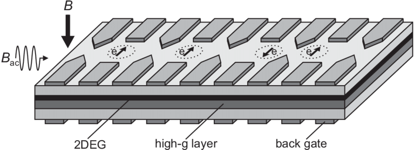
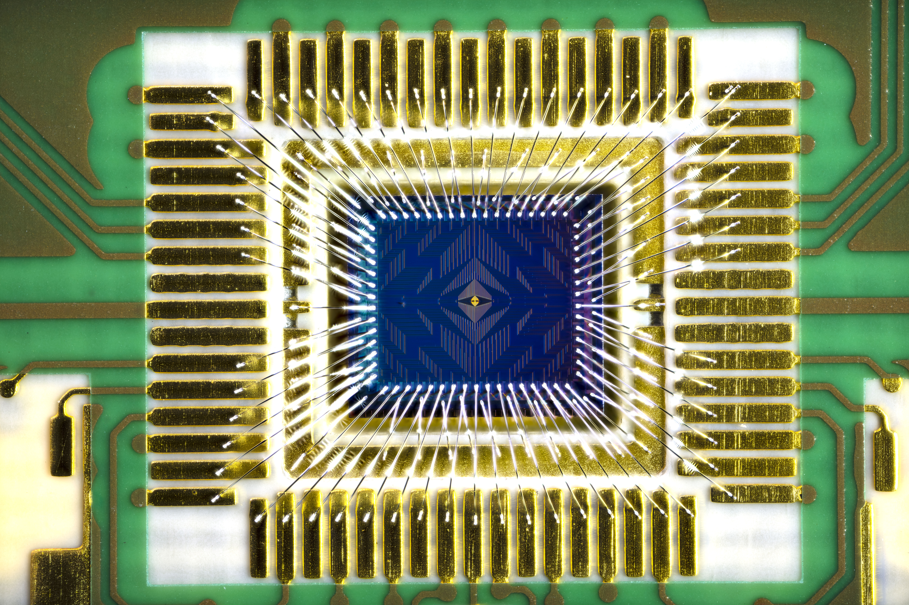

Silicon spin qubits are a promising way to build powerful quantum computers using technology similar to what's already used in today’s computer chips. These qubits store quantum information in the "spin" of individual electrons or atoms in silicon — a property similar to a tiny magnetic direction.

Because silicon is widely used in the semiconductor industry, this approach could lead to quantum chips that are easier to manufacture and scale up using existing fabrication tools.

---

## What Are Silicon Spin Qubits?

There are two main types of silicon spin qubits. Both store information using the magnetic spin of an electron or nucleus, but they use different physical systems.

### 1. Quantum Dot Spin Qubits

Quantum dots are tiny regions in silicon where a single electron can be trapped and controlled. The electron's spin direction (up or down) represents the 0 and 1 of quantum computing.

  
*Figure: Two quantum dots holding single electrons, where their spin states can be used as qubits.*  

### 2. Donor Spin Qubits

Donor spin qubits use atoms like phosphorus placed into the silicon crystal. The spin of the donor atom’s electron — or even its nucleus — can store quantum information.

  
*Figure: Coherent control of a donor-molecule electron spin qubit in silicon.*  
Source: [Nature Communications](https://www.nature.com/articles/s41467-021-23662-3)

---

## Intel's Tunnel Falls Chip

Intel has created a 12-qubit chip called **Tunnel Falls**, which uses silicon spin qubits. It was built using the same techniques as modern processors, showing how spin qubits can be scaled using industry tools.

  
*Figure: Intel's Tunnel Falls 12-qubit quantum research chip.*  
Source: [Intel Newsroom](https://newsroom.intel.com/new-technologies/quantum-computing-chip-to-advance-research)

---

## Cryogenic Control Hardware

To work correctly, silicon spin qubits must be kept at extremely cold temperatures — close to absolute zero. Special refrigerators and cryo-electronics are used to keep the system stable and quiet.

  
*Figure: Cryogenic hardware setup used to operate silicon spin qubits.*  
Source: [SpinQ](https://www.spinquanta.com/news-detail/cryogenic-quantum-hardware)

---

## Advantages of Silicon Spin Qubits

- **Scalable**: Can be made using standard chip-making (CMOS) techniques.
- **Long Coherence Times**: Qubits can stay stable for up to 0.5 seconds — long enough to perform many operations.
- **High Fidelity**: Single-qubit operations are over 99.9% accurate.
- **Less Cooling Needed**: Some devices may work at higher temperatures (around 1 Kelvin), which lowers hardware costs.

---

## Challenges

- **Precision Manufacturing**: Requires exact placement of atoms or quantum dots at the nanoscale.
- **Uniformity**: Making every qubit behave the same way across a large chip is difficult.
- **Wiring Complexity**: Controlling and reading many qubits at once takes complex wiring and electronics.

---

## Companies and Research Groups Working on Silicon Spin Qubits

- **[Intel](https://www.intel.com/content/www/us/en/research/quantum-computing.html)** – Building scalable silicon spin devices like the "Tunnel Falls" chip.
- **[Diraq](https://diraq.com/)** – Australian company developing spin qubits based on CMOS.
- **[Silicon Quantum Computing (SQC)](https://www.sqc.com.au/)** – Building an entire quantum system using spin qubits.
- **[Quantum Motion](https://quantummotion.tech/)** – UK-based team working on cryogenic silicon qubit chips.
- **[Equal1 Laboratories](https://equal1.com/)** – Combining quantum and classical computing in a compact silicon platform.

---

## Further Reading

- [Single-Electron Spin Qubits in Silicon for Quantum Computing](https://spj.science.org/doi/10.34133/icomputing.0115)  
  > A full review of the technology, pros and cons.

- [Quantum Error Correction with Silicon Spin Qubits](https://arxiv.org/abs/2201.08581)  
  > A paper showing how error correction can work with spin-based devices.

- [Semiconductor Spin Qubits Overview](https://arxiv.org/abs/2112.08863)  
  > Background and development history of spin qubits in semiconductors.

---

## See Also

- [Trapped Ion Quantum Computing](/hardware/ions/)
- [Topological Quantum Computing](/hardware/topological/)

---

*This page is part of the hardware directory exploring physical implementations of quantum computers.*
