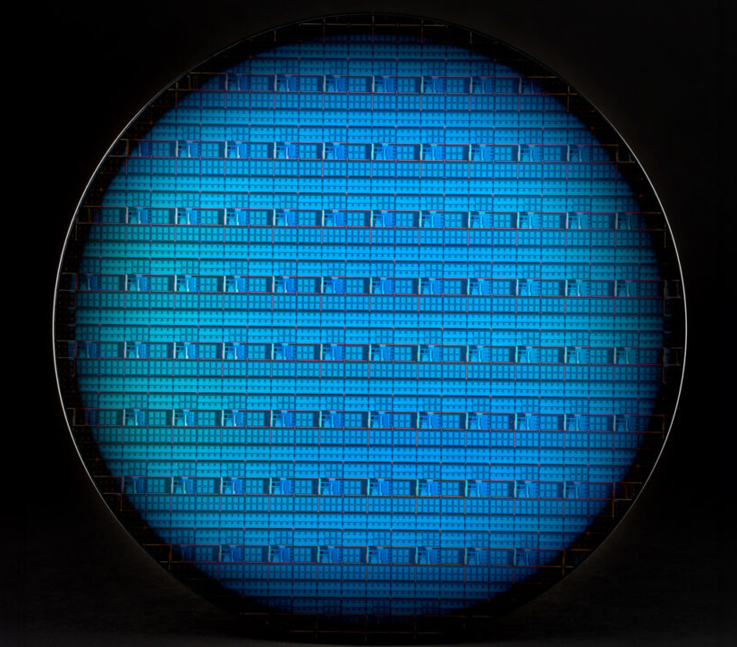

We recommend these learning resources to get started:
 - [The Ion Trap Quantum Information Processor](https://arxiv.org/abs/quant-ph/9608011) by Andrew M. Steane.  Last revised 9 Aug 1996.  Abstract: An introductory review of the linear ion trap is given, with particular regard to its use for quantum information processing. The discussion aims to bring together ideas from information theory and experimental ion trapping, to provide a resource to workers unfamiliar with one or the other of these subjects. It is shown that information theory provides valuable concepts for the experimental use of ion traps, especially error correction, and conversely the ion trap provides a valuable link between information theory and physics, with attendant physical insights. Example parameters are given for the case of calcium ions. Passive stabilisation will allow about 200 computing operations on 10 ions; with error correction this can be greatly extended.
 - [The trapped-ion qubit tool box](https://www.weizmann.ac.il/complex/ozeri/sites/complex.ozeri/files/uploads/teaching/QIon/00107514_2011.pdf) review by Roee Ozeri at the Weizmann Institute published as a tutorial in Contemporary Physics, 52, 531-550 (2011).  A course given at the Institute for Quantum Computing, University of Waterloo, Canada in 2013 with three lectures covering: Lecture 1: Ion qubits, trapping, and qubit initialization;  Lecture 2: qubit detection and single qubit gates; Lecture 3: Two-qubit entanglement gates and memory times.  Lecture notes available at [Roee Ozeri's teaching page](https://www.weizmann.ac.il/complex/ozeri/teaching/ion-qubit-toolbox-quantum-information-trapped-ions) along with notes for two other courses: Electro-optics and Quantum Information Processing.
  - [Quantum computing with trapped ions](https://arxiv.org/abs/0809.4368) by Haffner, Roos, and Blatt of the Innsbruck, Austria group.  Abstract: Quantum computers hold the promise to solve certain computational task much more efficiently than classical computers. We review the recent experimental advancements towards a quantum computer with trapped ions. In particular, various implementations of qubits, quantum gates and some key experiments are discussed. Furthermore, we review some implementations of quantum algorithms such as a deterministic teleportation of quantum information and an error correction scheme.
 

# Updated info:

 - Intel's CMOS-compatible spin qubits fabricated on 300-mm silicon wafers, operate via microwave and electric fields on single electron spins in a unit cell of 12 Si/Si~0.7~Ge~0.3~ quantum dots, and at cryogenic temperatures (1.6 K) for 99.9% single-qubit Clifford fidelities. Future proposals include extending the current unit cell to increase the number of logical qubits, and implement faster measurement hardware such as waveform generators and cryogenic amplifiers.
