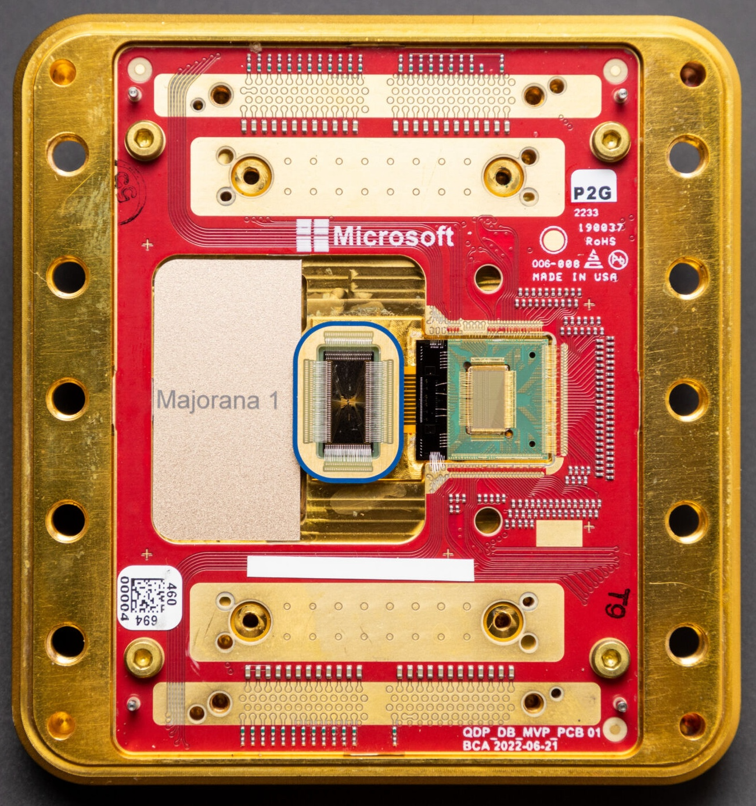

We recommend this learning resource to get started:
 - [A Collection of Resources for Learning Topological Quantum Computation by Fatimah Ahmadi](https://github.com/fatimahmadi/Blogposts/blob/master/TQC.md)
 

# Updated info:

 - The Majorana 1 quantum processor operates on topological qubit tetrons consisting of InAs–Al quantum dot heterostructures connected by a topological wire and in-perpendicular with a trivial superconducting wire, arranged in arrays for microwave-based qubit measurements and lattice surgery demonstrations. Major entangling gates include _Z_ and _X_. Future proposals include scaling tetron array size to increase the available number of logical qubits for fault tolerant quantum computing.
