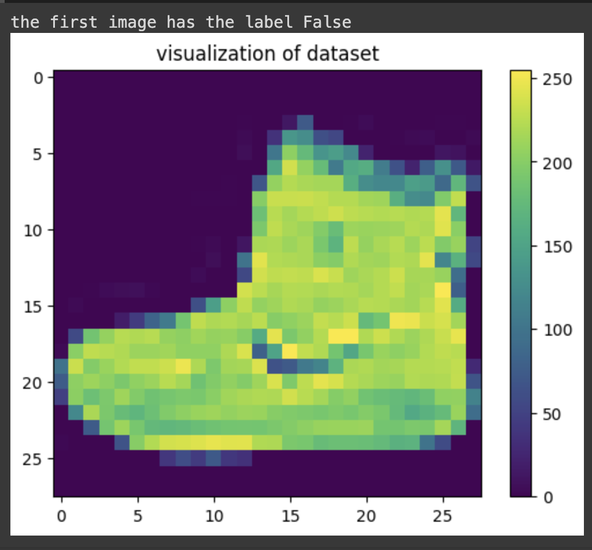
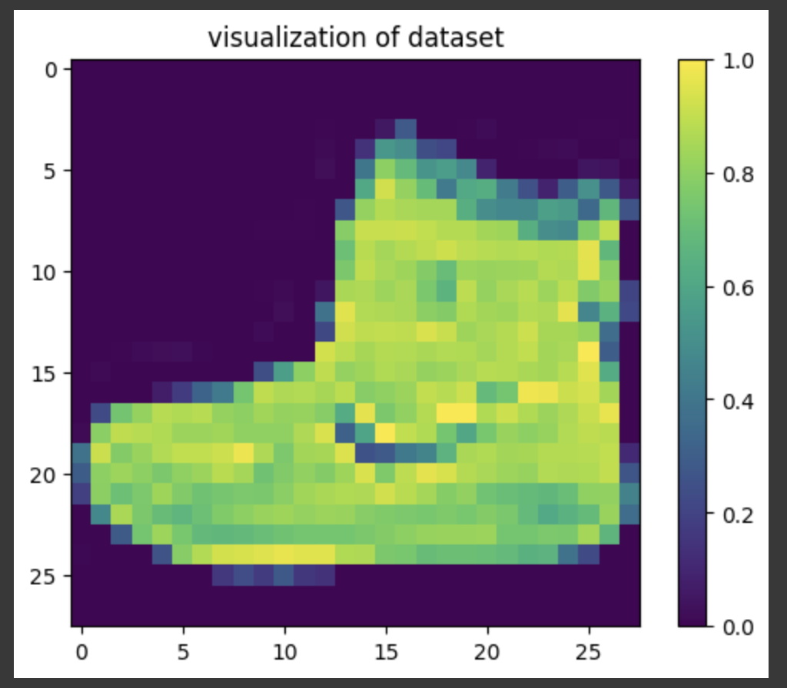
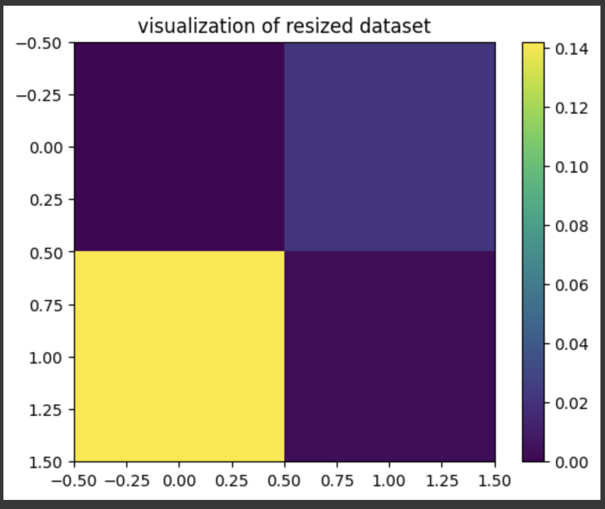
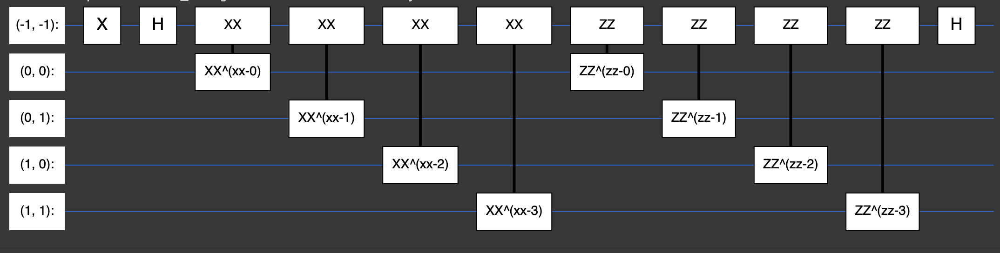

# Image classification on Fashion MNIST dataset using Quantum Convolutional Neural Network(QNN)

## Introduction :
Image classification is a fundamental task in the field of computer vision, aiming to assign a label to an image based on its visual content. With advancements in deep learning, traditional neural networks have achieved remarkable success in this area. However, the advent of quantum computing opens up new possibilities, particularly through hybrid quantum-classical approaches. This introduction delves into the use of TensorFlow Quantum and Cirq for classifying images from the Fashion MNIST dataset, combining the strengths of quantum computing with classical deep learning techniques.

## Fashion MNIST Dataset
The Fashion MNIST dataset is a widely used benchmark for image classification tasks, serving as a more challenging alternative to the classic MNIST dataset of handwritten digits. It consists of 70,000 grayscale images of fashion items, divided into 60,000 training images and 10,000 test images. Each image is 28x28 pixels and belongs to one of ten categories, such as t-shirts, trousers, and shoes. The simplicity of the images makes it an ideal starting point for experimenting with new machine learning techniques, including quantum computing.

## TensorFlow Quantum and Cirq
TensorFlow Quantum (TFQ) is an open-source library developed by Google, designed to integrate quantum computing into the TensorFlow ecosystem. It allows researchers to create quantum machine learning models using quantum circuits and integrate them seamlessly with classical neural networks. Cirq, on the other hand, is a Python library for designing, simulating, and running quantum circuits, also developed by Google. Together, TFQ and Cirq enable the creation of hybrid models that leverage both quantum and classical computing.

## Step-by-step guide on how to implement QNN with the help of tensorflow-quantum and cirq. 

### 1.Installation of libraries and packages.

If you already have tensorflow installed on your device then you can directly import tensorflow as below :
```
import tensorflow as tf
```
If you don't have tensorflow installed, install it with this command.
```
!pip install -q tensorflow
```
Next step will be to install tensorflow-quantum
```
!pip install -q tensorflow-quantum
```
Currently cirq 1.3.0 is compatible with tensorflow-quantum. It keeps on changing so always check the official documentation of both tensorflow-quantum and cirq.
```
!pip install cirq===1.3.0
```

The `tensorflow` library (`tf`) is imported to utilize its extensive machine learning functionalities, while `numpy` (`np`) is imported for efficient numerical computations. The `train_test_split` function from `sklearn.model_selection` is used to divide datasets into training and testing sets, which is crucial for validating machine learning models.

```
import tensorflow as tf
import numpy as np
from sklearn.model_selection import train_test_split
```
The core quantum computing libraries are `tensorflow_quantum` (`tfq`) and `cirq`. TensorFlow Quantum integrates quantum computing algorithms into the TensorFlow framework, enabling the development of quantum machine learning models. 
`Cirq` is a Google-developed library designed for creating, simulating, and running quantum circuits on quantum computers and simulators. 
`sympy` is imported to handle symbolic mathematics, which is often required for parameterized quantum circuits.

```
import tensorflow_quantum as tfq
import cirq
import sympy
```

For visualization, `SVGCircuit` from `cirq.contrib.svg` allows rendering of quantum circuits in SVG format, making it easier to visualize and debug quantum circuits. Finally, `matplotlib.pyplot` (`plt`) is imported for general plotting and visualization purposes, useful for displaying data and model performance. Together, these imports provide a comprehensive toolkit for developing and experimenting with quantum machine learning models.
```
from cirq.contrib.svg import SVGCircuit
import matplotlib.pyplot as plt
```
To ensure you have installed correct versions of the libraries, you can use :
```
print("We are using the Tensorflow-quantum verions {}".format(tfq.__version__))
print("We are using the Cirq verions {}".format(cirq.__version__))
```
### 2. Data Prepration.
First step will be to importing data and loading it.
```
from tensorflow.keras.datasets import fashion_mnist as dataset
(X_train, y_train), (X_test, y_test) = dataset.load_data()
```
To ensure we have successfulliy loaded data we'll print shape of `X_train` , `y_train`, `X_test` and `y_test`.
```
print("the shape of X_train is {}".format(X_train.shape))
print("the shape of y_train is {}".format(y_train.shape))
print("the shape of X_test is {}".format(X_test.shape))
print("the shape of y_test is {}".format(y_test.shape))
```
For this tutorial we will be using only two labels from dataset which are Label 5 and 9 which are `Sandal` and `Ankleboot` respectively. We'll filter our data based on these two labels. 
```
def filter_data(x,y):
  """

  Helper function to filter dataset for label 5 and 9

  """
  keep = (y==5) | (y==9)
  x, y = x[keep], y[keep]

  # y = true if y == 5 y = false if y == 9
  y = y == 5
  return x,y
```
Applying `filter_data` function on `X_train` ,`y_train`, `X_test` and `y_test`.
```
X_train, y_train = filter_data(X_train, y_train)
X_test, y_test = filter_data(X_test, y_test)

#Checking if changes are applied correctly
print("the shape of X_train is {}".format(X_train.shape))
print("the shape of y_train is {}".format(y_train.shape))
print("the shape of X_test is {}".format(X_test.shape))
print("the shape of y_test is {}".format(y_test.shape))
```
Plotting image from `X_train`:
```
print("the first image has the label {}".format(y_train[0]))
plt.imshow(X_train[0])
plt.colorbar()
plt.title("visualization of dataset")
plt.show()
```
Output :
<!--  -->


The pixel values in the Fashion MNIST dataset range from 0 to 255 (since they are 8-bit grayscale images). Dividing by 255.0 scales these values to the range [0, 1].Normalizing the data helps improve the performance and stability of the neural network during training. It ensures that the gradient descent algorithm converges more quickly and effectively by reducing the chances of getting stuck in local minima.
```
X_train = X_train/255.0
X_test = X_test/255.0
```
plt.imshow is a function from the matplotlib library that displays an image. X_train[0] accesses the first image in the training set. Since the image data is now normalized, plt.imshow will display it correctly by interpreting the values between 0 and 1 as grayscale intensities
```
plt.imshow(X_train[0])
plt.colorbar()
plt.title("visualization of dataset")
plt.show()
```


The `.reshape` function is used to modify the shape of these tensors.By adding `*(28, 28, 1)` after the comma, the code ensures the data is interpreted as a collection of images with a width of 28 pixels, a height of 28 pixels, and a single color channel (grayscale).
```
X_train = X_train.reshape(X_train.shape[0], *(28,28,1))
X_test = X_test.reshape(X_test.shape[0], *(28,28,1))
```
TensorFlow's `tf.image.resize` function is used to resize the images.
Both `X_train` and `X_test` are passed through this function, along with the target dimensions specified as a tuple (2, 2).
This resizes each image in the dataset to a much smaller size of 2 pixels by 2 pixels.The `.numpy()` function converts the resized tensors back to regular NumPy arrays, potentially for further manipulation or visualization.
```
X_train = tf.image.resize(X_train,(2,2)).numpy()
X_test = tf.image.resize(X_test, (2,2)).numpy()
```
Visualizing the image after processing : 
```
plt.imshow(X_train[1, : , :, 0])
plt.colorbar()
plt.title("visualization of resized dataset")
plt.show()

```


Splitting processed data using `train_test_split`:
```
X_train, X_valid, y_train, y_valid = train_test_split(X_train, y_train, test_size=0.15, random_state=0)
```

```
print("the shape of X_train is {}".format(X_train.shape))
print("the shape of y_train is {}".format(y_train.shape))
print("the shape of X_valid is {}".format(X_valid.shape))
print("the shape of y_valid is {}".format(y_valid.shape))
```

```
#flattening the images
X_train = X_train.reshape(X_train.shape[0], *(1,4,1))
X_valid = X_valid.reshape(X_valid.shape[0], *(1,4,1))
X_test = X_test.reshape(X_test.shape[0], *(1,4,1))
print(X_valid[0])
```

### 3. Data encoding

Quantum computers offer potential advantages in terms of speed and computational power for certain types of problems. Properly encoding data allows us to leverage these advantages for tasks like machine learning.
Ensuring Accurate Computation: Proper encoding ensures that the quantum computer can perform computations accurately and efficiently on the provided data. Without appropriate encoding, the data might not be correctly interpreted by the quantum algorithm, leading to incorrect results.


We have used binary encoding because it is simple and intuitive, making it easy to implement and understand. Classical computers also use binary representation, so this method provides a familiar framework for those transitioning to quantum computing.
```
def binary_encode(x, threshold=0.5):
  """
  Encodes the given dataset to use binary encoding

  Parameters:
  X (array) : Image data to be processed
  threshold - threshold for binary encoding, 0.5 by default

  Returns :
  encoded_images (array) : binary encoded image data

  if X > 0.5 :
    X = 1
  else :
    X = 0

  """
  encoded_images = list()
  for image in x:
    encoded_image = [1 if j>threshold else 0 for j in image[0]]
    encoded_images.append(encoded_image)

  return np.array(encoded_images)
```
Applying `binary_encode` to `X_train` :
```
X_train = binary_encode(X_train)
```
### 4. Creating Quantum Circuit :

The primary purpose of the create_circuit_from_image function is to take a binary-encoded image and convert it into a quantum circuit. This conversion is a crucial step in preparing classical data for quantum computation. The function achieves this by mapping each pixel of the binary-encoded image to a corresponding quantum gate operation on a set of qubits.
```
def create_circuit_from_image(encoded_image):
  """
  Returns a circuit for given encoded images

  """
  qubits = cirq.GridQubit.rect(2,2)
  circuit = cirq.Circuit()

  for i,pixel in enumerate(encoded_image):
    if pixel :
      circuit.append(cirq.X(qubits[i]))

    return circuit
```
### Steps Involved

#### 1. Define Qubits: T
he function starts by defining a set of qubits arranged in a 2x2 grid using cirq.GridQubit.rect(2,2). This setup creates four qubits, which will be used to represent the pixels of the image.

#### 2. Initialize Circuit: 
A quantum circuit is initialized using cirq.Circuit(). This circuit will be populated with quantum gate operations based on the pixel values of the encoded image.

#### 3.Map Pixels to Qubits: 
The function iterates over each pixel in the encoded image. For each pixel that has a value (i.e., the pixel is "on"), an X gate (also known as a NOT gate) is applied to the corresponding qubit. The X gate flips the state of the qubit from |0⟩ to |1⟩, encoding the pixel value into the quantum state.

```
X_train = [create_circuit_from_image(encoded_image) for encoded_image in X_train]
```
By converting binary-encoded images into quantum circuits, this function plays a vital role in bridging the gap between classical data and quantum computation, enabling the application of quantum machine learning techniques to image classification tasks.

Quantum machine learning models, such as quantum neural networks, require data in a format that can be fed into quantum layers. The `tfq.convert_to_tensor` function transforms quantum circuits into a format that TensorFlow Quantum can use, allowing us to build and train quantum machine learning models on classical datasets.
```
X_train_tfq = tfq.convert_to_tensor(X_train)
```
Applying same above process on `X_valid` and `X_test`:
```
#binary encoding
X_valid = binary_encode(X_valid)
X_test = binary_encode(X_test)

#encoding pixel value into the quantum state
X_valid =  [create_circuit_from_image(encoded_image) for encoded_image in X_valid]
X_test =  [create_circuit_from_image(encoded_image) for encoded_image in X_test]

#transforming quantum circuits into a tensors
X_valid_tfq = tfq.convert_to_tensor(X_valid)
X_test_tfq = tfq.convert_to_tensor(X_test)
```
### QNN Class: 

The QNN class encapsulates the creation and manipulation of quantum circuits that form the basis of quantum layers in these networks. The QNN class is designed to streamline the process of adding various quantum gates to circuits, which is essential for constructing the layers of a QNN.

The QNN class includes several methods that facilitate the construction and management of quantum circuits by adding single-qubit gates, two-qubit gates, and entire layers of gates.

```
class QNN():
  def __init__(self, data_qubits, readout):
    self.data_qubits = data_qubits
    self.readout = readout

  def add_singleQubit_gate(self, circuit, gate, qubit_index):
    """
    Adds single qubit gate to the circuit

    parameters:
    circuit(cirq.Circuit object) : Cirq circuit
    gate(cirq gate) : gate to append to the circuit
    gate[cirq_gate] : gate to append to circuit
    qubit_index(list) : index of qubits to apply the gate

    Returns:
    None

    """

    for index in qubit_index:
      circuit.append(gate(self.data_qubits[index]))

  def add_twoQubit_gate(self, circuit, gate, qubit_index):

    """
    Adds two qubit gate to the circuit

    parameters:
    circuit(cirq.Circuit object) : Cirq circuit
    gate(cirq gate) : gate to append to the circuit
    gate[cirq_gate] : gate to append to circuit
    qubit_index(list) : index of qubits to apply the gate

    Returns:
    None

    """
    if len(qubit_index)!= 2:
      raise Exception("the length of the list of indices passed for two qubit \ gate operations must be equal to two")

    circuit.append(gate(self.data_qubits[qubit_index[0]], self.data_qubits[qubit_index[1]]))

  def add_layer(self, circuit, gate, symbol_gate):

    """
    Adds new gates/layers to the circuit

    parameters:
    circuit(cirq.Circuit object) : Cirq circuit
    gate(cirq gate) : gate to append to the circuit
    gate[cirq_gate] : gate to append to circuit
    qubit_index(list) : index of qubits to apply the gate

    Returns:
    None

    """

    for i,qubit in enumerate(self.data_qubits):
      # symbol = sympy.Symbol(symbol_gate, '-' + str(i))
      symbol = sympy.Symbol(symbol_gate+ '-' + str(i))
      circuit.append(gate(qubit, self.readout)**symbol)
```

#### `__init__`  Method:

#### Purpose: 
Initializes the QNN class with a list of data qubits and a readout qubit.

#### Parameters:
1. data_qubits: List of qubits that will be used for data encoding and manipulation.
2. readout: A qubit used for reading the output of the quantum circuit.

#### `add_singleQubit_gate()` Method:

#### Purpose: 
Appends a single-qubit gate to the specified qubits in the circuit.

#### Parameters:

1. circuit: The quantum circuit to which the gate will be added.
2. gate: The single-qubit gate (like cirq.X, cirq.H) to be added.
3. qubit_index: List of indices indicating which qubits the gate should be applied to.

This method simplifies the addition of single-qubit gates, making it easier to construct complex circuits with specific operations applied to designated qubits.

#### `add_twoQubit_gate()` Method:
Purpose: Adds a two-qubit gate (like cirq.CX, cirq.CZ) to the circuit between the specified pair of qubits.
#### Parameters:
1. circuit: The quantum circuit to which the gate will be added.
2. gate: The two-qubit gate to be added.
3. qubit_index: List of two indices indicating which pair of qubits the gate should be applied to.
   
This method ensures that two-qubit gates are correctly applied only when the correct number of qubits (two) is specified, thus avoiding errors in gate application.

#### `add_layer()` Method:

#### Purpose: 
Adds a layer of gates to the circuit, with parameterized symbols to facilitate learning in a quantum neural network.

#### Parameters:
1. circuit: The quantum circuit to which the layer will be added.
2. gate: The gate type to be added to the circuit.
3. symbol_gate: The symbolic representation of the gate parameter for use in optimization.
   

This method is crucial for constructing parameterized quantum circuits, where the parameters (symbols) can be adjusted during the training process to learn the optimal configuration for a given task.

### Creating Quantum Neural Network


```
def create_qnn():
  data_qubits = cirq.GridQubit.rect(2,2)
  readout = cirq.GridQubit(-1,-1)
  circuit = cirq.Circuit()

  circuit.append(cirq.X(readout))
  circuit.append(cirq.H(readout))

  qnn = QNN(
      data_qubits = data_qubits,
      readout = readout
  )

  qnn.add_layer(circuit, cirq.XX, "xx")
  qnn.add_layer(circuit, cirq.ZZ, "zz")

  circuit.append(cirq.H(readout))

  return circuit, cirq.Z(readout)
```
#### Defining Qubits:

1. `cirq.GridQubit.rect(2,2)` creates a rectangle of qubits with dimensions 2x2. This defines the `"data qubits"` where the quantum operations will be applied.
2. `cirq.GridQubit(-1,-1)` creates a single qubit at the bottom right corner (-1, -1) which is designated as the `readout qubit`. 
3. `readout qubit` qubit will be measured at the end to extract information from the circuit.
   
#### Initializing the Circuit:

An empty circuit object is created using cirq.Circuit(). This will store the quantum operations to be performed.

#### Readout State Preparation:

The circuit starts by applying a Pauli-X gate `cirq.X` to the readout qubit. This initializes the readout qubit to the `|1>` state.
Then, a Hadamard gate (cirq.H) is applied to the readout qubit. This puts the readout qubit in a superposition of `|0>` and `|1>` states.

#### Adding Layers to the Circuit:

The `add_layer` function is defined in `QNN` class. 

1. with `cirq.XX` as the gate and `"xx"` as the name, adding a layer of controlled-NOT gates between all pairs of qubits in the data_qubits rectangle.
Again with `cirq.ZZ` as the gate and `"zz"` as the name, adding a layer of controlled-phase gates between all pairs of qubits in the data rectangle.

#### Final Readout State Preparation:

Another Hadamard gate (`cirq.H`) is applied to the readout qubit.

#### Returning the Circuit and Readout Measurement:

The function returns two values:
1. The final circuit object `circuit` containing all the quantum operations.
2. A single-qubit Pauli-Z gate `cirq.Z(readout)` applied to the readout qubit. This signifies that the readout qubit will be measured in the Z-basis after running the circuit.


Calling the `create_qnn()` method and storing results in `qmodel`(circuit) and `model_readout`(circuit readout) variables respectively. 

```
qmodel, model_readout = create_qnn()
```


`SVGCircuit` from `cirq.contrib.svg` allows rendering of quantum circuits in SVG format, making it easier to visualize and debug quantum circuits. Visualizing the circuit we got as a result after calling `create_qnn()` method.
```
SVGCircuit(qmodel)
```
It should return circuit like this:

<!-- image -->

```
model = tf.keras.Sequential(
    [
        tf.keras.layers.Input(shape=(), dtype=tf.string),

        tfq.layers.PQC(qmodel, model_readout),
    ]
)
```
#### Sequential Model:

`tf.keras.Sequential` is used to create a sequential model, which means the layers are added one after another, and the output of each layer becomes the input for the next.

#### String Input Layer:

The first layer is a `tf.keras.layers.Input` layer with a specific configuration:

`shape=()` indicates it expects a single scalar value as input.
`dtype=tf.string` specifies the data type of the input to be strings.

This suggests the model take encoded information about a quantum circuit, potentially representing the circuit structure or parameters, as input.

#### PQC Layer:

The second layer is a custom layer from TensorFlow Quantum (tfq).
`tfq.layers.PQC` is a layer specifically designed for working with quantum circuits.

Two arguments are passed to this layer:

1. `qmodel`: Variable or function that represents the quantum model itself.A circuit object function that builds the circuit dynamically based on the input string.
2. `model_readout`: readout operator.
   

   


Code snippet below converts labels in NumPy arrays `y_train`, `y_valid`, and `y_test` to a binary representation where 1 represents a sandal and -1 represents all other classes.The result of the list comprehension is converted into a NumPy array using np.array.
```
y_train_h = np.array([1 if i==1 else -1 for i in y_train ])
y_valid_h = np.array([1 if i==1 else -1 for i in y_valid ])
y_test_h = np.array([1 if i==1 else -1 for i in y_test ])
```
#### Hinge Accuracy function :
```
def hinge_accuracy(y_true, y_pred):
    y_true = tf.squeeze(y_true) > 0.0
    y_pred = tf.squeeze(y_pred) > 0.0
    result = tf.cast(y_true == y_pred, tf.float32)

    return tf.reduce_mean(result)
```
#### Squeezing Inputs:

 `tf.squeeze` removes any single-dimensional elements from the input tensors `y_true` and `y_pred`. This ensures they are flattened tensors without unnecessary dimensions.
   
#### Thresholding:

 The `>` operator is used element-wise on both `y_true` and `y_pred` with a threshold of 0.0.
This effectively converts any value greater than 0.0 to `True` and anything less than or equal to 0.0 to `False`.

#### Comparing Labels and Predictions:

An element-wise comparison (==) between the thresholded `y_true` and `y_pred` is performed.
This results in a tensor of True values where both labels and predictions matched (either both positive or both negative), and False values otherwise.

#### Casting and Averaging:

`tf.cast` converts the boolean tensor (containing True and False) to a float32 tensor where True becomes 1.0 and False becomes 0.0.
Essentially, it transforms correct classifications into 1 and incorrect ones into 0.
Finally, `tf.reduce_mean` calculates the average of this float32 tensor.

```
model.compile(
    loss=tf.keras.losses.Hinge(),
    optimizer=tf.keras.optimizers.Adam(learning_rate=0.001),
    metrics=[hinge_accuracy])
```

#### Loss Function:

`loss=tf.keras.losses.Hinge()`: This sets the loss function to be the hinge loss. The Hinge loss is suitable for binary classification tasks where labels are typically encoded as -1 and 1. It penalizes the model for incorrect classifications and aims to increase the margin between the correct class and the incorrect class.

#### Optimizer:

`optimizer=tf.keras.optimizers.Adam(learning_rate=0.001)`: This configures the Adam optimizer to be used for updating the model's weights during training. The learning rate is set to 0.001, which controls how much the model adjusts its weights in each iteration.

#### Metrics:

`metrics=[hinge_accuracy]`: A list containing a single custom metric function named hinge_accuracy. This metric, defined previously, calculates the accuracy based on a threshold applied to both labels and predictions.

This code configures the model for training with a hinge loss function, the Adam optimizer with a specific learning rate, and a custom hinge accuracy metric to track performance during the training process.

### Model fitting : 
```
qnn_history = model.fit(
      X_train_tfq, y_train_h,
      batch_size=64,
      epochs=10,
      verbose=1,
      validation_data=(X_valid_tfq, y_valid_h))
```
#### Function:

`qnn_history = model.fit(...)`: This line calls the fit method on the compiled Keras model (model). The fit method is responsible for training the model on the provided data.

#### Arguments:

1. `X_train_tfq`: This represents the training data likely preprocessed for use with the TensorFlow Quantum layer (`tfq.layers.PQC`). 
2. `y_train_h`: This is the training set of binary labels, transformed previously using `y_train_h = np.array([1 if i==1 else -1 for i in y_train ])`. It contains labels for the training data where 1 represents the target class and -1 represents all other classes.
3. `batch_size=64`: This sets the batch size to 64. During training, the model will process data in batches of 64 samples at a time. This helps improve efficiency and memory usage.
4. `epochs=10`: This specifies the number of training epochs. The model will go through the entire training data set 10 times, updating its weights based on the errors observed in each pass.
5. `verbose=1`: This sets the verbosity level for training output. With verbose=1, the model will print a progress bar and some basic information during training.
6. `validation_data=(X_valid_tfq, y_valid_h)`: This provides a separate validation set for monitoring the model's performance during training. It consists of two tensors: `X_valid_tfq` containing encoded validation circuits and `y_valid_h` containing the corresponding binary labels for the validation set.
   
#### Output:

`qnn_history`: The fit method returns a history object (qnn_history). This object stores information about the training process, such as loss values and metrics (hinge accuracy) for both training and validation data at each epoch. You can use this history object later to analyze the training progress and evaluate the model's performance.

```
model.evaluate(X_test_tfq, y_test_h)
```

calls the evaluate method on the trained model (model). This method is designed to assess the model's performance on a new dataset it hasn't been trained on.

The model achieved a hinge accuracy of 50% on the test data, While the low accuracy suggests the model requires further improvement.But goal of this article is to provide basic idea of how one can implement quantum neural network similar to classical neural networks. 